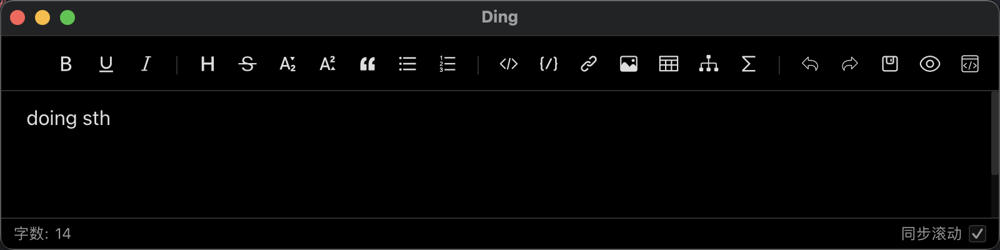
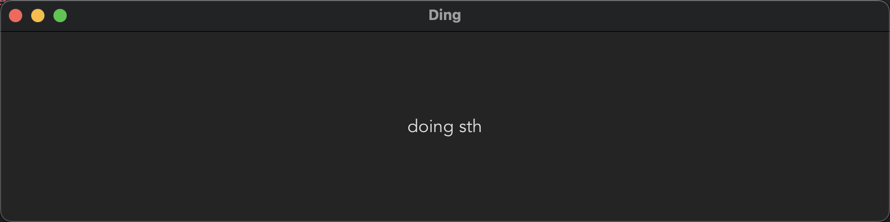

## ding

a tool that always placed at the top to remind

### how to use

#### dependency

* rust
* node
* npm

#### install

```shell
npm run tauri build
```

#### shortcut

unmutable shortcut is:

```text
CommandOrControl+U
```

#### example




### rely on and thanks

* [tauri](https://tauri.app/)

* [md-editor-v3](https://imzbf.github.io/)

* [tauri-plugin-window-state](https://github.com/tauri-apps/tauri-plugin-window-state)

### fix on windows
1. download [msys2](https://www.msys2.org/)

2. set gcc path
```powershell
 $env:path+=";C:\msys64\ucrt64\bin"
```

### changelog

#### v0.1.0

first available version

#### v0.1.1

- support saving position and size by [tauri-plugin-window-state](https://github.com/tauri-apps/tauri-plugin-window-state)

- fix set on top button
